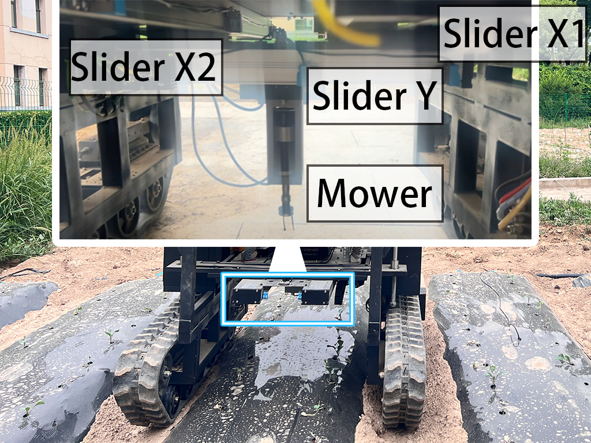

# ros_gt_desk: GT-02 Tools platform control



Communication with PLC device via modbus to control electronic tools on the lifting platforms.

Currently, includes `gantry sliders` (two x-axis sliders and one y slider) and a `mower`.


The original version (`CtrNoParam.msg` for zeroing, `node.py` for sending, `operhand.msg` for mower control, [@吕瑞](https://github.com/ouranar), [@张培](https://github.com/ZP1931301733), [@赵盼盼](https://github.com/lzuzhaopp) ) was restored at [15ec71](https://github.com/JChrysanthemum/ros_gt_desk/tree/15ec71f8cbe6e292ee5fd2820e5937d4a6de1643).

------

# 2. Structure

```
├── CMakeLists.txt
├── LICENSE
├── README.md
├── config           # for configuration of PLC or other devices
├── doc              # markdown doc for this repo
├── include          # cpp head files
├── launch           # ros launch file 
├── misc             # tiny images or other temp files
├── msg              # ros message
├── package.xml
├── scripts          # ros python scripts
└── src              # ros cpp source file
```


<style>
table th:first-of-type {
    width: 20%;
}
table th:nth-of-type(2) {
    width: 80%;
}
</style>


File|Comment
-----|-----
[mower_control.launch](launch/mower_control.launch)| Start ros node to process control msg and send to PLC; Also recieve msg from PLC periodically. Launch this **FIRST** before sending or recieving anything.
[PLC_Config.json](config/PLC_Config.json)| The host address, port, polling rate and register detail were restore in this json file.
[configParser.h](include/ros_gt_desk/configParser.h)|Use nlohmann to read json file. Call `getValueByPath<T>()` to get corresponding value in config json. List index is supported.
[modbus_wrapper.cpp](src/modbus_wrapper.cpp)| Connect to PLC device and process input value from a int32 into 2 int16 that could be restored at PLC holding registers.
[ros_gt_desk.cpp](src/ros_gt_desk.cpp)| Control node for all devices. You can find topic and corresponding msg here.
[modbus_dummy.py](scripts/modbus_dummy.py)| For **DEBUGING**, create a virtual PLC server at localhost, that you can test your new code locally.
[modbus_reader.py](scripts/modbus_reader.py) | For **DEBUGING**, check the name of corresponding register in PLC. Check name in [PLC_Config.json](config/PLC_Config.json).


<style>
table th:first-of-type {
    width: 20%;
}
table th:nth-of-type(2) {
    width: 15%;
}
table th:nth-of-type(3) {
    width: 65%;
}
</style>


Topic|Device|Message
-----|-----|-----
/gt_desk/mower_control | Mower Control| [MotorControl.msg](msg/MotorControl.msg)
/gt_desk/mower_status | Mower Surveillance | [MotorControl.msg](msg/MotorControl.msg)  # same as control
/gt_desk/slider_control | Sliders Control| [SliderControl.msg](msg/SliderControl.msg) # x,y is a list has three value, so x [1,2,3]

